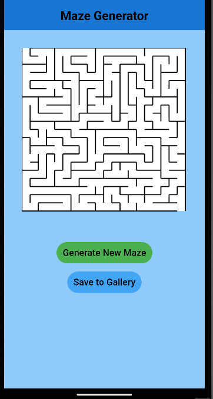
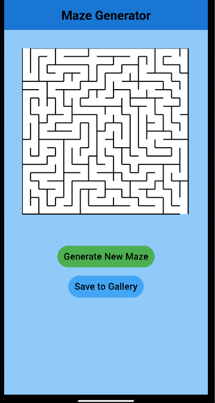

# Maze Generator

A maze generating app that currently uses a randomized depth-first search algorithm to determine the path of the maze. 

  
  

## Goals

Checkmarked items are either completed or mostly completed.

- [x] Random maze generation
- [x] Saving mazes as png files
- [ ] Saving a maze to a custom gallery built into the app
- [ ] Unique home page
- [ ] A slider that controls maze size
- [ ] Options to choose between different maze generating algorithms
- [ ] A visual representation of maze solving

## How to Use the App

1. Launch the app
2. Press the green "Generate New Maze" button to generate a maze
3. To save the current displayed maze press the "Save to Gallery" button
